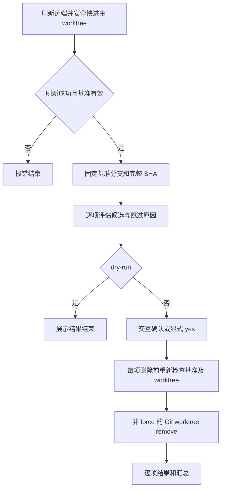

# 状态判定修复与已合并 worktree 清理

## 目标与范围

保留 list 默认刷新和并发查询方式，修正状态解析、查询失败误报、快进后的提交展示，以及 remove 使用目录代替提交引用的检查。新增 prune，清理已合并且无未提交改动的 worktree。ignored 内容随目录删除，保留本地和远端分支。

## 命令与处理流程

| 命令 | 行为 |
|---|---|
| grove prune | 刷新、预览、确认、清理 |
| grove prune --dry-run | 刷新并预览，不删除 |
| grove prune --yes | 刷新并非交互清理 |
| grove --plain prune --dry-run / --yes | 对应动作使用 TSV 输出 |

非交互模式必须显式指定 dry-run 或 yes；两者互斥。无 force 参数。

主 worktree 分支的本地完整 SHA 是合并基准，未发布到远端但已包含在本地主分支的提交也符合条件；不把远端分支删除或平台 MR 状态作为依据。squash/rebase 合并如果没有祖先关系则跳过。

排除主目录、当前目录（含其子目录）、locked、detached、缺失/异常目录、包含其他登记 worktree 的目录、进行中的 merge/rebase/cherry-pick/revert/bisect、未合并提交以及暂存/修改/冲突/未跟踪内容。查询失败一律不删除。通过实际根目录、共享 Git 目录、分支与 HEAD 核验身份。删除前复查，基准变化中止，候选变化跳过。

允许 ignored 文件随目录删除，不跟随符号链接清理外部目录。使用非 force Git 命令，Git 拒绝删除的情况记录为失败并继续其他独立项。无法提供跨进程原子锁；复查与 Git 自身删除检查共同降低并发修改窗口，不宣称能锁定其他进程。

## 契约变更与影响

| 契约 | 变更前后与消费方动作 |
|---|---|
| CLI | 新增 prune；原 list 调用方式、自动刷新和并发逻辑不变。shell 补全同步增加命令参数 |
| list TSV | 字段顺序不变；查询失败由错误的 0/no 改为 N/A，脚本需要兼容未知值 |
| prune TSV | branch、path、result、reason；result 为 candidate/skipped/removed/failed。字段中的反斜杠和控制字符转义；诊断及汇总走 stderr |
| Git 状态协议 | 使用 porcelain v2 NUL 分隔记录，正确解析 XY、重命名源路径、冲突和子模块；显式扫描未跟踪文件，不受隐藏未跟踪文件配置影响 |
| 合并算法 | 沿用提交祖先关系；使用完整 SHA。失败与未合并分离 |
| remove 检查 | 配置 upstream 时比较 upstream..HEAD；否则比较主 worktree SHA..HEAD。Git 查询失败传播，不按空输出放行 |
| Rust API | Worktree 增加 locked/bare、commit 保存完整 SHA；状态结果显式携带错误；MergeState 增加 Unknown。grove-core 与 CLI 同步升至 0.2.0，下游按新字段/类型适配 |
| 数据库 | 无变化，DDL：无变化 |
| 配置与持久化 | 无新配置或缓存，无历史数据迁移。prune 删除目录及登记，保留分支；ignored 文件删除不可由 Git 恢复 |

正常跳过不导致失败退出。删除失败、刷新失败或执行中基准改变返回非零。发生全局错误前已完成的逐项结果仍打印，未尝试的条目保留 candidate。

## 验证

临时仓库覆盖状态字段、重命名与特殊文件名、冲突、异常索引、同步后的 COMMIT；覆盖 prune 预览与删除、ignored 内容、外部链接、分支保留、各种跳过项、基准/候选变化、失败传播及刷新异常。既有集成测试绑定 Cargo 当前构建二进制，避免误测旧 release 文件。真实 Raven 仓库仅执行 dry-run 核对候选。

## 上线步骤

1. 发布前完成 cargo fmt、clippy、all-targets 测试、安全审计及 shell/E2E 检查，确认分支不落后目标分支。
2. 创建 PR，等待 CI，通过后合并；使用版本 tag 触发既有发布流水线。
3. 按 grove-core、grove-cli、GitHub Release 的既有流水线顺序发布 0.2.0，核实各阶段成功。
4. 从发布版本更新本地安装；同步主工作目录，使本地 source 的 shell 补全生效。
5. 固定 Case：临时仓库实际删除 ignored 内容、保留外部链接目标与分支、拒绝脏/未合并目录；真实仓库执行 list 与 prune --dry-run。
6. 无数据重算/backfill，无自动任务恢复。
7. 通过逐项结果、汇总和退出码观测。工具可重新安装上一版本；分支可重建受跟踪文件，已删除 ignored 文件没有自动回滚入口。
