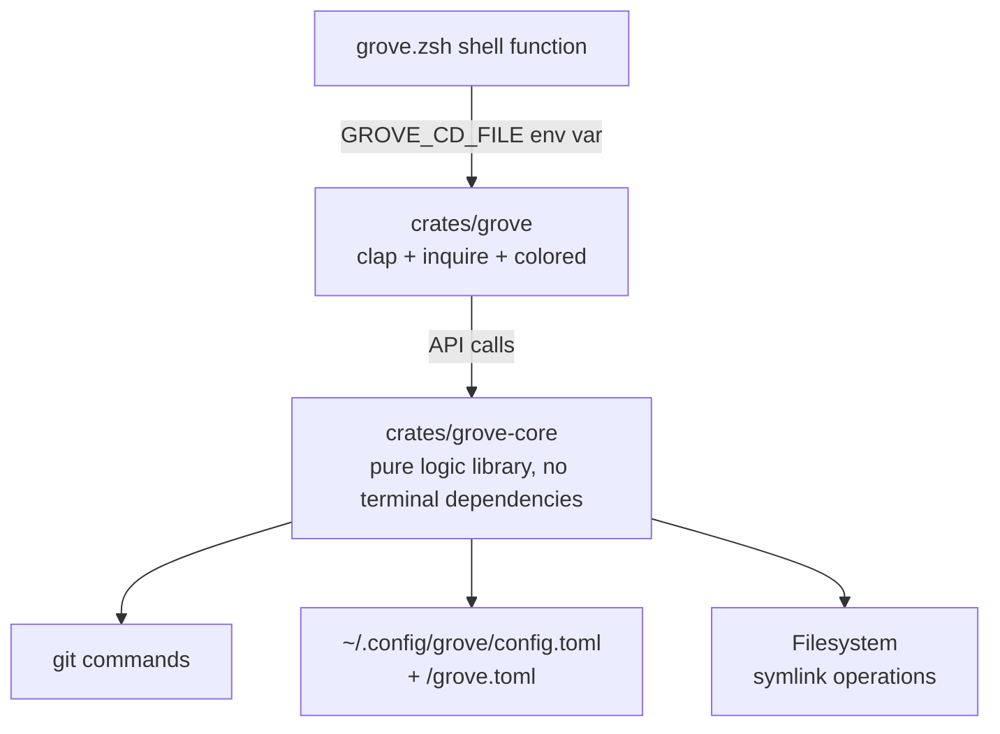

# grove Rust Migration Design

## 1. Background and Motivation

grove is a git worktree management tool, currently implemented in Bash (~800 lines). The functionality is stable, but it has the following limitations:

- Bash code is difficult to write automated tests for
- Complex logic (such as gitignore-style glob matching) is hard to maintain in Bash
- Lack of unified configuration management
- Inconvenient cross-platform distribution

This migration rewrites grove in Rust, preserving all functionality while adding tests, CI, and a distribution system.

## 2. Goals and Non-Goals

### Goals

1. **Complete feature migration**: Preserve all existing functionality; user behavior should be identical before and after migration
2. **Test coverage**: Unit tests covering core logic, integration tests covering complete command chains
3. **Unified configuration**: Global config + project-level config, TOML format, following XDG conventions
4. **CI/CD**: GitHub Actions for automatic lint / test / build, tag-triggered release
5. **Distribution**: Publish to crates.io, `cargo install grove` for one-command installation

### Non-Goals

- No new features (equivalent migration only)
- No Windows support (Linux + macOS only)
- No shell integration beyond Zsh

## 3. Current Feature Inventory

Based on a complete review of the v0.3.0 source code.

| Command | Function | Key Behavior |
|---------|----------|--------------|
| `grove list` | List worktrees | human: colored table; plain: TSV |
| `grove add` | Create worktree | local/new/remote branch; fzf interactive branch selection; automatic cache symlink |
| `grove switch` | Switch worktree | Output cd path; fzf interactive + 5 commits preview |
| `grove remove` | Remove worktree | Safety checks (uncommitted/unpushed); --force to skip; main worktree protection; auto cd out |
| `grove cache` | Cache symlink | link/status/unlink sub-operations; gitignore-style rule matching |

### Output Modes

| Mode | Trigger | Purpose |
|------|---------|---------|
| `human` (default) | Terminal interactive | Colored, formatted, fzf selection |
| `plain` (`--plain`) | AI / scripts | TSV format, no color, deterministic output |

### Configuration

| Config | Current Implementation | After Migration |
|--------|----------------------|-----------------|
| Worktree base path | Env var `GROVE_WORKTREE_BASE`, default `~/.grove/worktrees` | Same |
| Cache rules | `~/.groverc` + `<repo>/.groverc`, gitignore-style | `~/.config/grove/config.toml` + `<repo>/grove.toml`, TOML format |

## 4. Overall Architecture

Uses a Cargo Workspace architecture: one core logic library crate + one CLI binary crate.

```
grove/                           # Repository root
├── Cargo.toml                   # Workspace declaration
├── crates/
│   ├── grove-core/              # Core logic library
│   │   ├── Cargo.toml
│   │   └── src/
│   │       ├── lib.rs           # Library entry, exposes public API
│   │       ├── config.rs        # Config parsing (TOML + rule model)
│   │       ├── worktree.rs      # Worktree CRUD core logic
│   │       ├── cache.rs         # Cache symlink rule matching and operations
│   │       ├── git.rs           # Git command wrappers (status parsing, branch queries)
│   │       ├── path.rs          # Path computation (worktree paths, short paths, etc.)
│   │       └── pattern.rs       # Gitignore-style glob matching engine
│   └── grove/                   # CLI binary
│       ├── Cargo.toml
│       └── src/
│           ├── main.rs          # Entry: parse → dispatch
│           ├── cli.rs           # Clap command/argument definitions
│           ├── output.rs        # Dual-mode output (human colored / plain text)
│           └── interactive.rs   # inquire interactive selection
├── shell/
│   └── grove.zsh                # Zsh shell integration (cd + tab completion)
├── tests/
│   ├── integration/             # Integration tests (operating on real git repos)
│   └── e2e/                     # End-to-end tests
├── docs/                        # Documentation
├── .github/
│   └── workflows/
│       ├── ci.yml               # PR checks (lint / test / build)
│       └── release.yml          # Release (crates.io)
├── README.md
├── install.sh                   # Quick install script
└── LICENSE
```

### Dependency Relationships



### Separation of Concerns

| Layer | Crate | Dependencies | Responsibilities |
|-------|-------|-------------|------------------|
| Shell | `shell/grove.zsh` | Rust binary | cd bridging + tab completion |
| CLI | `grove` | grove-core, clap, inquire | Argument parsing, display, interaction |
| Core | `grove-core` | serde, toml | All business logic |

The Core layer has no terminal/UI dependencies, can run unit tests independently, and tests complete in milliseconds when there are no I/O side effects.

## 5. CLI Interface Design

### 5.1 Command Definitions

```rust
#[derive(Parser)]
#[command(name = "grove", version, about = "Git worktree manager")]
struct Cli {
    #[arg(long, default_value_t = false)]
    plain: bool,

    #[command(subcommand)]
    command: Commands,
}

#[derive(Subcommand)]
enum Commands {
    #[command(alias = "ls")]
    List,

    #[command(alias = "new")]
    Add {
        branch: Option<String>,
        #[arg(long, short)]
        create: bool,
        #[arg(long, short)]
        remote: bool,
        #[arg(long)]
        no_cache: bool,
    },

    #[command(alias = "cd")]
    Switch {
        branch: Option<String>,
    },

    #[command(alias = "rm")]
    Remove {
        branch: Option<String>,
        #[arg(long, short)]
        force: bool,
    },

    Cache {
        #[command(subcommand)]
        action: Option<CacheAction>,
    },
}
```

### 5.2 Behavior Rules (Unified Conventions)

| Command | Branch argument provided | Not provided |
|---------|------------------------|--------------|
| `add` | Execute directly | Enter inquire interactive selection |
| `switch` | Find worktree, output path | Enter inquire interactive selection |
| `remove` | Find worktree, safety check, execute | Enter inquire interactive selection |
| `list` | N/A | Output directly |
| `cache` | N/A | With sub-command execute directly, without enter interactive |

### 5.3 Output Format

**Human mode** (`grove list`):
```
  BRANCH        DIR                        COMMIT   STATUS
* feat/foo      ~/code/proj/feat-foo       a1b2c3d  clean
  feat/bar      ~/code/proj/feat-bar       e4f5g6h  +3 ~1 ?2
```

**Plain mode** (`grove --plain list`):
```
branch<TAB>path<TAB>commit<TAB>staged=N<TAB>modified=N<TAB>untracked=N<TAB>ahead=N<TAB>behind=N
```

All log/error messages go to stderr; stdout only outputs data (plain mode) or formatted text (human mode).

## 6. Core Module Design

### 6.1 Data Structures

```rust
// ── worktree ──

/// A worktree instance
struct Worktree {
    branch: String,      // Branch name, "feat/foo" or "(detached)"
    path: PathBuf,       // Absolute path
    commit: String,      // 7-character short hash
}

/// git status parsing result
struct WorktreeStatus {
    staged: u32,
    modified: u32,
    untracked: u32,
    ahead: u32,
    behind: u32,
}

struct WorktreeEntry {
    wt: Worktree,
    status: WorktreeStatus,
    is_main: bool,
}

// ── config ──

/// TOML top-level structure
struct GroveConfig {
    #[serde(default)]
    cache: CacheSection,
    #[serde(default)]
    worktree: WorktreeSection,
}

struct CacheSection {
    /// Rules evaluated in order, last-match-wins
    #[serde(default)]
    rules: Vec<String>,
}

struct WorktreeSection {
    /// Alternative to GROVE_WORKTREE_BASE env var (optional)
    #[serde(default)]
    base_path: Option<String>,
}

// ── pattern ──

/// A compiled matching rule
struct CompiledRule {
    raw: String,
    negated: bool,
    anchored: bool,
    matcher: Matcher,
}

enum Matcher {
    Exact(String),                    // "node_modules"
    Wildcard(String),                 // "*.log"
    Recursive { prefix: String, suffix: String }, // "a/**/b"
    Prefix(String),                   // "packages/*"
    Suffix(String),                   // "*/build"
}
```

### 6.2 Module: config

**Config loading priority (low → high):**

```
1. ~/.config/grove/config.toml       Global config
2. <project>/grove.toml              Project config
```

Note: The old `.groverc` (gitignore-style plain text) is no longer supported; everything migrates to TOML format.

**Merge rules:**

- Struct fields with the same key: later loaded overwrites earlier loaded
- `cache.rules` list: global rules first, project rules appended after
- Rule evaluation: last-match-wins in list order, so project rules automatically override global

**TOML example:**

```toml
# ~/.config/grove/config.toml
[cache]
rules = [
    "node_modules",
    ".cache/*",
]

[worktree]
base_path = "~/worktrees"
```

```toml
# <project>/grove.toml
[cache]
rules = [
    "!**/test",
    "packages/*/node_modules",
]
```

### 6.3 Module: pattern (gitignore-style matching engine)

#### Matching Specification

| Rule Type | Example | Matching Logic |
|-----------|---------|----------------|
| Literal (no `/`) | `node_modules` | Matches path basename |
| Literal (with `/`) | `packages/node_modules` | Matches full path or path suffix |
| Anchored (`/` prefix) | `/build` | Only matches repository root |
| `*` wildcard (single level) | `*.log` | Matches any name at current level |
| `?` wildcard | `ab?.txt` | Matches single character at current level |
| `**` recursive | `a/**/b` | `**` matches zero or more directory levels |
| `/**` suffix | `packages/**` | Matches `packages` and all descendants |
| `**/` prefix | `**/node_modules` | Equivalent to unanchored `node_modules` |
| Negation (`!`) | `!.cache/private` | Cancels a previous rule's match |

#### Matching Flow

```
Input: one rule text + one repo-relative path

1. Preprocessing:
   ├── Starts with !? → negated = true, remove !
   └── Starts with /? → anchored = true, remove /

2. If anchored → exact match from root

3. If pattern contains /**/ → split into prefix + suffix, anchor both ends

4. If pattern starts with **/ → remove and match unanchored

5. If pattern ends with /** → remove and match prefix and its descendants

6. If pattern contains / (without **) → match full path or suffix

7. If pattern does not contain / → match last segment (basename)
```

#### Rule Evaluation (last-match-wins)

```
For a given relative path:
  selected = false

  for rule in rules:       # Global first, project after
    if matches(rule, path):
      selected = !rule.negated

  return selected
```

#### Safety Checks

Reject the following patterns (return error):
- Empty string
- Contains `../`
- Just `..`

### 6.4 Module: cache

Three sub-operations, all driven by the same rule evaluation engine.

```
link (default)
  ┌── Load config rules
  ├── Scan main worktree (find -type d, skip .git)
  ├── Evaluate rules for each directory path
  ├── Filter: selected == true AND source exists
  └── For each target:
       ├── Target already exists → skip
       ├── Parent directory missing → mkdir -p
       └── Create symlink: ln -s <source> <target>

status
  ┌── Load config rules
  ├── Scan main worktree
  └── Display status for each rule:
       linked:   Already a symlink
       local:    Real directory exists (not a symlink)
       missing:  Should be a symlink but doesn't exist, source available
       N/A:      Rule didn't match any directory

unlink
  ┌── Load config rules
  ├── Scan current worktree
  └── For each symlink matched by rules: delete it
  (Only deletes symlinks, not real directories)
```

**Key behaviors:**

- Only processes directories, not files
- Symlink targets are **absolute paths** (because worktrees may be in different locations)
- Skips `.git` directory
- `grove add` automatically runs link afterward (can be skipped with `--no-cache`)
- Existing directories/files/symlinks are not overwritten
- Newly added cache directories require manual `grove cache link` afterward

### 6.5 Module: worktree

```rust
/// List all worktrees
fn list_all() -> Result<Vec<WorktreeEntry>>;

/// Find worktree by branch name
fn find_by_branch(branch: &str) -> Result<PathBuf>;

/// Create worktree
fn add(branch: &str, opts: AddOptions) -> Result<PathBuf>;

/// Remove worktree
fn remove(branch: &str, force: bool) -> Result<()>;

/// Get main worktree path
fn main_worktree() -> Result<PathBuf>;
```

**Path computation:**

```
worktree_dir = {WORKTREE_BASE}/{project_name}/{safe_branch}

WORKTREE_BASE: Env var GROVE_WORKTREE_BASE
               or config.worktree.base_path
               or default ~/.grove/worktrees

project_name: git remote get-url origin → basename → remove .git

safe_branch: Replace / with -
```

**add behavior:**

| Scenario | Operation |
|----------|-----------|
| `add <branch>` | `git worktree add <path> <branch>` |
| `add <branch> --create` | `git worktree add -b <branch> <path>` |
| `add <branch> --remote` | fetch --all → if local exists `git worktree add <path> <branch>`, otherwise `git worktree add --track -b <branch> <path> <remote/branch>` |

**remove safety checks:**

```
1. Cannot remove main worktree
2. Check uncommitted changes: git status --porcelain != empty → block (unless --force)
3. Check unpushed commits: git log @{u}..HEAD != empty → block (unless --force)
4. If current directory is inside the worktree being removed → auto cd to main worktree
```

### 6.6 Module: git

Wrappers for git commands, all calls via `std::process::Command`:

```rust
/// Ensure we're in a git repo
fn ensure_git_repo() -> Result<()>;

/// Parse git worktree list --porcelain
fn parse_worktree_list() -> Result<Vec<Worktree>>;

/// Parse git status --porcelain=v2 --branch
fn parse_status(path: &Path) -> Result<WorktreeStatus>;

/// Extract project name (from origin URL)
fn project_name() -> Result<String>;

/// Get main worktree directory
fn main_worktree_dir() -> Result<PathBuf>;

/// List local branches
fn list_branches() -> Result<Vec<String>>;

/// List remote branches
fn list_remote_branches() -> Result<Vec<String>>;
```

## 7. Interactive UI

Uses the `inquire` crate (pure Rust, no external dependencies), replacing the current fzf.

### 7.1 `grove add` interaction

```
Step 1: Select "Select action"
  > existing branch
    new branch
    remote branch

Step 2 (existing): Select "Select existing branch"
  > feat/login
    feat/api-v2
    fix/typo
  (Type to search/filter)

Step 2 (new): Text "Enter new branch name: "

Step 2 (remote): fetch --all --prune first, then Select
  > origin/main
    origin/feat/login
    second/feat/only-on-second
```

### 7.2 `grove switch` interaction

```
Select "Select worktree"
  > feat/login   ~/code/proj/feat-login
    main          ~/code/proj
    feat/api-v2   ~/code/proj/feat-api-v2
```

### 7.3 `grove remove` interaction

```
Select "Select worktree to remove" (excluding main worktree)
  > feat/login
    feat/api-v2

Confirm "Remove worktree 'feat/login'? [y/N]"
```

**Error handling:** When safety checks fail, show a clear prompt and exit without performing the removal.

## 8. Shell Integration

### 8.1 zsh wrapper

```zsh
# shell/grove.zsh
grove() {
    local _cd_file=$(mktemp)

    GROVE_CD_FILE="$_cd_file" \
        command grove "$@"
    local rc=$?

    if [[ -s "$_cd_file" ]]; then
        builtin cd "$(<$_cd_file)"
    fi
    rm -f "$_cd_file"
    return $rc
}
```

### 8.2 How it works

```
zsh grove() function
  → Create temp file
  → GROVE_CD_FILE=<temp file path> grove <args>
  → Rust binary executes operation
  → When directory change needed: write path to GROVE_CD_FILE
  → Rust exits
  → zsh reads temp file contents
  → builtin cd <path>
  → Delete temp file
```

### 8.3 Rust-side emit_cd

```rust
fn emit_cd(path: &Path) {
    if let Ok(file) = env::var("GROVE_CD_FILE") {
        fs::write(&file, path.display().to_string()).ok();
    } else if is_plain_mode() {
        // Non-shell environment + plain mode: print path directly
        println!("{}", path.display());
    }
    // Non-shell environment + human mode: don't output cd path
}
```

### 8.4 Tab Completion

Same as current version, implemented in `grove.zsh` using `compdef`:
- Command completion (list / add / switch / remove / cache / help / version)
- Global flag completion (`--plain`)
- Add: complete branch names + flags (`--create` / `--remote` / `--no-cache`)
- Switch / remove: complete existing worktree branch names

### 8.5 Quick Aliases

```zsh
alias wls='grove ls'
alias wnw='grove new'
alias wcd='grove cd'
alias wrm='grove rm'
```

## 9. Testing Strategy

### 9.1 Unit Tests

Location: Same file as source code, `#[cfg(test)] mod tests`

| Module | Coverage Focus |
|--------|---------------|
| `pattern` | Each matching rule type; anchored/unanchored; `**` recursive; negation; safety rejection |
| `config` | TOML parsing; empty/missing file tolerance; rule order preservation; multi-layer merge; old `.groverc` compatibility |
| `path` | Worktree path computation; HOME→~; `/`→`-` escaping |
| `git` | Command output parsing (branch list, status porcelain v2); error handling |
| `worktree` | Branch finding; main worktree protection; add/remove logic |
| `cache` | Rule evaluation; symlink paths; skip conditions |
| `output` | TSV formatting; color switching; cd file writing |

### 9.2 Integration Tests

Location: `tests/integration/`, each file is an independent test binary.

Each test creates a temporary git repo (bare origin + clone), runs under isolated HOME and GROVE_WORKTREE_BASE.

```
tests/integration/
├── add_tests.rs         # Local branch / --create / --remote / --no-cache
├── list_tests.rs        # Human and plain output formats
├── remove_tests.rs      # Safety checks / --force / main worktree protection
├── switch_tests.rs      # Path output / GROVE_CD_FILE writing
└── cache_tests.rs       # link / status / unlink / rule overrides
```

### 9.3 E2E Tests

Location: `tests/e2e/`, simulating complete user workflows.

```
tests/e2e/
└── smoke.sh             # install → add → list → cache → switch → remove
```

### 9.4 Coverage Targets

| Type | Target |
|------|--------|
| Core logic (pattern / config / git parsing) | > 90% branch coverage |
| Overall | > 80% line coverage |

## 10. CI / CD

### 10.1 PR Checks (`.github/workflows/ci.yml`)

```yaml
name: CI
on: [push, pull_request]

jobs:
  lint:
    runs-on: ubuntu-latest
    steps:
      - uses: actions/checkout@v4
      - run: cargo clippy --all-targets -- -D warnings
      - run: cargo fmt --check

  test:
    strategy:
      matrix:
        os: [ubuntu-latest, macos-latest]
    runs-on: ${{ matrix.os }}
    steps:
      - uses: actions/checkout@v4
      - run: cargo test --all-targets

  build:
    runs-on: ubuntu-latest
    steps:
      - uses: actions/checkout@v4
      - run: cargo build --release
```

### 10.2 Release (`.github/workflows/release.yml`)

```yaml
name: Release
on:
  push:
    tags: ['v*']

jobs:
  publish:
    runs-on: ubuntu-latest
    steps:
      - uses: actions/checkout@v4
      - run: cargo test --all-targets
      - run: cargo publish --token ${{ secrets.CARGO_TOKEN }}
```

## 11. Key Dependencies

### grove-core

| Crate | Version | Purpose |
|-------|---------|---------|
| `serde` | 1 | Serialization/deserialization (config TOML) |
| `toml` | 0.8 | TOML parsing |
| `thiserror` | 1 | Error type definitions |

### grove (CLI)

| Crate | Version | Purpose |
|-------|---------|---------|
| `clap` | 4 | Command-line argument parsing (derive mode) |
| `inquire` | 0.7 | Interactive selection / text input |
| `console` | 0.15 | Terminal colored output |
| `anyhow` | 1 | Convenient error handling |

## 12. Migration Strategy

### 12.1 Phased Implementation

1. **Set up project skeleton**: Workspace + CI + crate structure
2. **core::config**: TOML parsing + rule model
3. **core::pattern**: Glob matching engine + unit tests
4. **core::git**: Git command wrappers
5. **core::worktree**: Worktree CRUD
6. **core::cache**: Cache rule evaluation + symlink operations
7. **cli**: Clap definitions + command dispatch + output
8. **shell**: zsh wrapper + tab completion
9. **install.sh**: Install script
10. **Docs**: README + usage documentation

### 12.2 Legacy Code Cleanup

- All Bash code (`bin/grove`, `lib/*.sh`, `shell/grove.zsh`) will be deleted after PR merge
- `.groverc` format is no longer supported (migrating to TOML), but the new version can provide a one-time migration command

### 12.3 Compatibility

- CLI command and argument names remain unchanged where possible (seamless switch for user scripts)
- `--plain` output format unchanged
- `GROVE_WORKTREE_BASE` env var continues to be supported (takes priority over config file)

## Appendix A: Revision History

| Date | Version | Changes |
|------|---------|---------|
| 2026-06-08 | v1.0 | Initial design |
