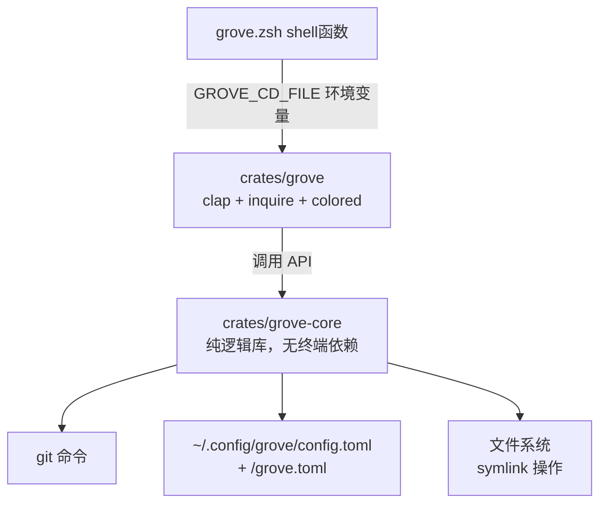

# grove Rust 迁移设计方案

## 1. 背景与动机

grove 是一个 git worktree 管理工具，当前用 Bash 实现（~800 行）。功能已稳定，但存在以下局限：

- Bash 代码难以编写自动化测试
- 复杂逻辑（如 gitignore 风格 glob 匹配）在 Bash 中难以维护
- 缺乏统一的配置管理
- 跨平台分发不便

本次迁移将 grove 用 Rust 重写，在保留全部功能的前提下，补齐测试、CI 和分发体系。

## 2. 目标与非目标

### 目标

1. **功能完整迁移**：保留所有现有功能，用户在迁移前后行为无差异
2. **测试覆盖**：单元测试覆盖核心逻辑，集成测试覆盖完整命令链路
3. **统一配置**：全局配置 + 项目级配置，TOML 格式，遵循 XDG 规范
4. **CI/CD**：GitHub Actions 自动 lint / test / build，tag 触发发布
5. **分发**：crates.io 发布，`cargo install grove` 一键安装

### 非目标

- 不新增功能（仅做等价迁移）
- 不支持 Windows（仅 Linux + macOS）
- 不支持 Zsh 以外的 shell 集成

## 3. 现状功能清单

基于对 v0.3.0 源码的完整梳理。

| 命令 | 功能 | 关键行为 |
|------|------|---------|
| `grove list` | 列出 worktree | human: 彩色表格; plain: TSV |
| `grove add` | 创建 worktree | 本地/新建/远程分支; fzf 交互选分支; 自动 cache symlink |
| `grove switch` | 切换 worktree | 输出 cd 路径; fzf 交互 + 5 commits preview |
| `grove remove` | 删除 worktree | 安全检查(未提交/未推送); --force 跳过; 主 worktree 保护; 自动 cd 离开 |
| `grove cache` | cache symlink | link/status/unlink 三个子操作; gitignore 风格规则匹配 |

### 输出模式

| 模式 | 触发 | 用途 |
|------|------|------|
| `human`（默认） | 终端交互 | 彩色、格式化、fzf 选择 |
| `plain`（`--plain`） | AI / 脚本 | TSV 格式、无颜色、确定性输出 |

### 配置

| 配置 | 当前实现 | 迁移后 |
|------|---------|--------|
| worktree 基路径 | 环境变量 `GROVE_WORKTREE_BASE`，默认 `~/.grove/worktrees` | 同 |
| cache 规则 | `~/.groverc` + `<repo>/.groverc`，gitignore 风格 | `~/.config/grove/config.toml` + `<repo>/grove.toml`，TOML 格式 |

## 4. 总体架构

采用 Cargo Workspace 架构：一个核心逻辑库 crate + 一个 CLI 二进制 crate。

```
grove/                           # 仓库根
├── Cargo.toml                   # workspace 声明
├── crates/
│   ├── grove-core/              # 核心逻辑库
│   │   ├── Cargo.toml
│   │   └── src/
│   │       ├── lib.rs           # 库入口，暴露公共 API
│   │       ├── config.rs        # 配置解析（TOML + 规则模型）
│   │       ├── worktree.rs      # worktree 增删查改核心逻辑
│   │       ├── cache.rs         # cache symlink 规则匹配与操作
│   │       ├── git.rs           # git 命令封装（status 解析、分支查询）
│   │       ├── path.rs          # 路径计算（worktree 路径、短路径等）
│   │       └── pattern.rs       # gitignore 风格 glob 匹配引擎
│   └── grove/                   # CLI 二进制
│       ├── Cargo.toml
│       └── src/
│           ├── main.rs          # 入口：parse → dispatch
│           ├── cli.rs           # clap 命令/参数定义
│           ├── output.rs        # 双模输出（human 彩色 / plain 纯文本）
│           └── interactive.rs   # inquire 交互式选择
├── shell/
│   └── grove.zsh                # Zsh shell 集成（cd + tab completion）
├── tests/
│   ├── integration/             # 集成测试（操作真实 git 仓库）
│   └── e2e/                     # 端到端测试
├── docs/                        # 文档
├── .github/
│   └── workflows/
│       ├── ci.yml               # PR 检查（lint / test / build）
│       └── release.yml          # 发布（crates.io）
├── README.md
├── install.sh                   # 快速安装脚本
└── LICENSE
```

### 依赖关系



### 职责分离

| 层 | crate | 依赖 | 职责 |
|----|-------|------|------|
| Shell | `shell/grove.zsh` | Rust 二进制 | cd 桥接 + tab 补全 |
| CLI | `grove` | grove-core, clap, inquire | 参数解析、展示、交互 |
| Core | `grove-core` | serde, toml | 所有业务逻辑 |

Core 层不依赖任何终端/UI 库，可独立运行单元测试，无 I/O 副作用时测试毫秒级完成。

## 5. CLI 接口设计

### 5.1 命令定义

```rust
#[derive(Parser)]
#[command(name = "grove", version, about = "Git worktree manager")]
struct Cli {
    #[arg(long, default_value_t = false)]
    plain: bool,

    #[command(subcommand)]
    command: Commands,
}

#[derive(Subcommand)]
enum Commands {
    #[command(alias = "ls")]
    List,

    #[command(alias = "new")]
    Add {
        branch: Option<String>,
        #[arg(long, short)]
        create: bool,
        #[arg(long, short)]
        remote: bool,
        #[arg(long)]
        no_cache: bool,
    },

    #[command(alias = "cd")]
    Switch {
        branch: Option<String>,
    },

    #[command(alias = "rm")]
    Remove {
        branch: Option<String>,
        #[arg(long, short)]
        force: bool,
    },

    Cache {
        #[command(subcommand)]
        action: Option<CacheAction>,
    },
}
```

### 5.2 行为规则（统一约定）

| 命令 | 提供了 branch 参数 | 未提供 |
|------|-------------------|--------|
| `add` | 直接执行 | 进入 inquire 交互选择 |
| `switch` | 查找 worktree，输出路径 | 进入 inquire 交互选择 |
| `remove` | 查找 worktree，安全检查，执行 | 进入 inquire 交互选择 |
| `list` | N/A | 直接输出 |
| `cache` | N/A | 有子命令直接执行，无进入交互 |

### 5.3 输出格式

**human 模式**（`grove list`）：
```
  BRANCH        DIR                        COMMIT   STATUS
* feat/foo      ~/code/proj/feat-foo       a1b2c3d  clean
  feat/bar      ~/code/proj/feat-bar       e4f5g6h  +3 ~1 ?2
```

**plain 模式**（`grove --plain list`）：
```
branch<TAB>path<TAB>commit<TAB>staged=N<TAB>modified=N<TAB>untracked=N<TAB>ahead=N<TAB>behind=N
```

所有日志/错误信息一律输出到 stderr，stdout 只输出数据（plain 模式）或格式化文本（human 模式）。

## 6. 核心模块设计

### 6.1 数据结构

```rust
// ── worktree ──

/// 一个 worktree 实例
struct Worktree {
    branch: String,      // 分支名，"feat/foo" 或 "(detached)"
    path: PathBuf,       // 绝对路径
    commit: String,      // 7 位短 hash
}

/// git status 解析结果
struct WorktreeStatus {
    staged: u32,
    modified: u32,
    untracked: u32,
    ahead: u32,
    behind: u32,
}

struct WorktreeEntry {
    wt: Worktree,
    status: WorktreeStatus,
    is_main: bool,
}

// ── config ──

/// TOML 顶层结构
struct GroveConfig {
    #[serde(default)]
    cache: CacheSection,
    #[serde(default)]
    worktree: WorktreeSection,
}

struct CacheSection {
    /// 规则按序求值，last-match-wins
    #[serde(default)]
    rules: Vec<String>,
}

struct WorktreeSection {
    /// 替代 GROVE_WORKTREE_BASE 环境变量（可选）
    #[serde(default)]
    base_path: Option<String>,
}

// ── pattern ──

/// 编译后的单条匹配规则
struct CompiledRule {
    raw: String,
    negated: bool,
    anchored: bool,
    matcher: Matcher,
}

enum Matcher {
    Exact(String),                    // "node_modules"
    Wildcard(String),                 // "*.log"
    Recursive { prefix: String, suffix: String }, // "a/**/b"
    Prefix(String),                   // "packages/*"
    Suffix(String),                   // "*/build"
}
```

### 6.2 模块：config

**配置加载优先级（低→高）：**

```
1. ~/.config/grove/config.toml       全局配置
2. <project>/grove.toml              项目配置
```

注意：旧的 `.groverc`（gitignore 风格纯文本）不再支持，全部迁移到 TOML 格式。

**合并规则：**

- 同 key 的结构字段：后加载覆盖先加载
- `cache.rules` 列表：全局规则在前，项目规则拼接在后
- 规则求值：按照列表顺序 last-match-wins，因此项目规则自动覆盖全局

**TOML 示例：**

```toml
# ~/.config/grove/config.toml
[cache]
rules = [
    "node_modules",
    ".cache/*",
]

[worktree]
base_path = "~/worktrees"
```

```toml
# <project>/grove.toml
[cache]
rules = [
    "!**/test",
    "packages/*/node_modules",
]
```

### 6.3 模块：pattern（gitignore 风格匹配引擎）

#### 匹配规格

| 规则类型 | 示例 | 匹配逻辑 |
|---------|------|---------|
| 字面量（无 `/`） | `node_modules` | 匹配 path 的 basename |
| 字面量（含 `/`） | `packages/node_modules` | 匹配完整路径或路径后缀 |
| 锚定（`/` 开头） | `/build` | 仅匹配仓库根目录 |
| `*` 通配（单层） | `*.log` | 匹配当前层级任意名称 |
| `?` 通配 | `ab?.txt` | 匹配当前层级单个字符 |
| `**` 递归 | `a/**/b` | `**` 匹配零或多个目录层级 |
| `/ **` 后缀 | `packages/**` | 匹配 `packages` 及其所有子孙 |
| `**/ ` 前缀 | `**/node_modules` | 等价于非锚定 `node_modules` |
| 取反（`!`） | `!.cache/private` | 取消之前规则的匹配 |

#### 匹配流程

```
输入: 一条 rule 文本 + 一个仓库相对路径

1. 预处理:
   ├── 以 ! 开头? → negated = true，去掉 !
   └── 以 / 开头? → anchored = true，去掉 /

2. 如果 anchored → 从根精确匹配

3. 如果 pattern 含 /**/  → 拆分为 prefix + suffix, 锚定两端

4. 如果 pattern 以 **/ 开头 → 去掉后非锚定匹配

5. 如果 pattern 以 /** 结尾 → 去掉后匹配前缀及其子孙

6. 如果 pattern 含 / (不含 **) → 匹配完整路径或后缀

7. 如果 pattern 不含 / → 匹配最后一段 (basename)
```

#### 规则求值（last-match-wins）

```
对给定的相对路径 path:
  selected = false

  for rule in rules:       # 全局在前，项目在后
    if matches(rule, path):
      selected = !rule.negated

  return selected
```

#### 安全检查

拒绝以下模式（返回错误）：
- 空字符串
- 包含 `../`
- 仅 `..`

### 6.4 模块：cache

三个子操作，均通过同一套规则求值引擎驱动。

```
link（默认）
  ┌── 加载配置规则
  ├── 扫描主 worktree（find -type d，跳过 .git）
  ├── 对每个目录路径执行规则求值
  ├── 筛选：selected == true 且 source 存在
  └── 对每个目标：
       ├── 目标已存在 → 跳过
       ├── 父目录不存在 → mkdir -p
       └── 创建 symlink: ln -s <source> <target>

status
  ┌── 加载配置规则
  ├── 扫描主 worktree
  └── 对每条规则显示状态：
       linked:   已是 symlink
       local:    存在真实目录（非 symlink）
       missing:  本应是 symlink 但不存在，source 可用
       N/A:      规则未匹配到任何目录

unlink
  ┌── 加载配置规则
  ├── 扫描当前 worktree
  └── 对每个由规则匹配到的 symlink：删除它
  （只删除 symlink，不删除真实目录）
```

**关键行为：**

- 只处理目录，不处理文件
- symlink 目标是**绝对路径**（因为 worktree 可能在不同位置）
- 跳过 `.git` 目录
- `grove add` 后自动执行 link（可通过 `--no-cache` 跳过）
- 已存在的目录/文件/symlink 不覆盖
- 后续新增 cache 目录需手动重新 `grove cache link`

### 6.5 模块：worktree

```rust
/// 列出所有 worktree
fn list_all() -> Result<Vec<WorktreeEntry>>;

/// 按分支名查找 worktree
fn find_by_branch(branch: &str) -> Result<PathBuf>;

/// 创建 worktree
fn add(branch: &str, opts: AddOptions) -> Result<PathBuf>;

/// 删除 worktree
fn remove(branch: &str, force: bool) -> Result<()>;

/// 获取主 worktree 路径
fn main_worktree() -> Result<PathBuf>;
```

**路径计算：**

```
worktree_dir = {WORKTREE_BASE}/{project_name}/{safe_branch}

WORKTREE_BASE: 环境变量 GROVE_WORKTREE_BASE
               或 config.worktree.base_path
               或默认 ~/.grove/worktrees

project_name: git remote get-url origin → basename → 去掉 .git

safe_branch: 将 / 替换为 -
```

**add 行为：**

| 场景 | 操作 |
|------|------|
| `add <branch>` | `git worktree add <path> <branch>` |
| `add <branch> --create` | `git worktree add -b <branch> <path>` |
| `add <branch> --remote` | fetch --all → 如果本地存在则 `git worktree add <path> <branch>`，否则 `git worktree add --track -b <branch> <path> <remote/branch>` |

**remove 安全检查：**

```
1. 不允许删除主 worktree
2. 检查未提交变更: git status --porcelain ≠ 空 → 阻止（除非 --force）
3. 检查未推送提交: git log @{u}..HEAD ≠ 空 → 阻止（除非 --force）
4. 如果当前目录在待删除 worktree 内 → 自动 cd 到主 worktree
```

### 6.6 模块：git

对 git 命令的封装，所有调用通过 `std::process::Command`：

```rust
/// 确保在 git 仓库中
fn ensure_git_repo() -> Result<()>;

/// 解析 git worktree list --porcelain
fn parse_worktree_list() -> Result<Vec<Worktree>>;

/// 解析 git status --porcelain=v2 --branch
fn parse_status(path: &Path) -> Result<WorktreeStatus>;

/// 提取项目名（从 origin URL）
fn project_name() -> Result<String>;

/// 获取主 worktree 目录
fn main_worktree_dir() -> Result<PathBuf>;

/// 列出本地分支
fn list_branches() -> Result<Vec<String>>;

/// 列出远程分支
fn list_remote_branches() -> Result<Vec<String>>;
```

## 7. 交互式 UI

使用 `inquire` crate（纯 Rust，无外部依赖），替代当前 fzf。

### 7.1 `grove add` 交互

```
Step 1: Select "选择操作"
  > existing branch
    new branch
    remote branch

Step 2 (existing): Select "选择已有分支"
  > feat/login
    feat/api-v2
    fix/typo
  (输入即搜索过滤)

Step 2 (new): Text "输入新分支名: "

Step 2 (remote): 先 fetch --all --prune，然后 Select
  > origin/main
    origin/feat/login
    second/feat/only-on-second
```

### 7.2 `grove switch` 交互

```
Select "选择 worktree"
  > feat/login   ~/code/proj/feat-login
    main          ~/code/proj
    feat/api-v2   ~/code/proj/feat-api-v2
```

### 7.3 `grove remove` 交互

```
Select "选择要删除的 worktree"（不含主 worktree）
  > feat/login
    feat/api-v2

Confirm "确认删除 worktree 'feat/login'? [y/N]"
```

**错误处理：** 安全检查失败时显示明确提示并退出，不执行删除。

## 8. Shell 集成

### 8.1 zsh wrapper

```zsh
# shell/grove.zsh
grove() {
    local _cd_file=$(mktemp)

    GROVE_CD_FILE="$_cd_file" \
        command grove "$@"
    local rc=$?

    if [[ -s "$_cd_file" ]]; then
        builtin cd "$(<$_cd_file)"
    fi
    rm -f "$_cd_file"
    return $rc
}
```

### 8.2 工作原理

```
zsh grove() 函数
  → 创建临时文件
  → GROVE_CD_FILE=<临时文件路径> grove <args>
  → Rust 二进制执行操作
  → 需要切换目录时：把路径写入 GROVE_CD_FILE
  → Rust 退出
  → zsh 读取临时文件内容
  → builtin cd <路径>
  → 删除临时文件
```

### 8.3 Rust 侧的 emit_cd

```rust
fn emit_cd(path: &Path) {
    if let Ok(file) = env::var("GROVE_CD_FILE") {
        fs::write(&file, path.display().to_string()).ok();
    } else if is_plain_mode() {
        // 非 shell 环境 + plain 模式：直接打印路径
        println!("{}", path.display());
    }
    // 非 shell 环境 + human 模式：不输出 cd 路径
}
```

### 8.4 Tab 补全

同当前版本，在 `grove.zsh` 中用 `compdef` 实现：
- 命令补全（list / add / switch / remove / cache / help / version）
- 全局 flag 补全（`--plain`）
- add 时补全分支名 + flag（`--create` / `--remote` / `--no-cache`）
- switch / remove 时补全现有 worktree 分支名

### 8.5 快捷别名

```zsh
alias wls='grove ls'
alias wnw='grove new'
alias wcd='grove cd'
alias wrm='grove rm'
```

## 9. 测试策略

### 9.1 单元测试

位置：与源码同文件，`#[cfg(test)] mod tests`

| 模块 | 覆盖重点 |
|------|---------|
| `pattern` | 每条匹配规则类型；锚定/非锚定；`**` 递归；取反；安全拒绝 |
| `config` | TOML 解析；空文件/缺文件容错；规则顺序保持；多层合并；旧名 `.groverc` 兼容 |
| `path` | worktree 路径计算；HOME→~；`/`→`-` 转义 |
| `git` | 命令输出解析（branch list、status porcelain v2）；错误处理 |
| `worktree` | 分支查找；主 worktree 保护；add/remove 逻辑 |
| `cache` | 规则求值；symlink 路径；skip 条件 |
| `output` | TSV 格式化；颜色切换；cd 文件写入 |

### 9.2 集成测试

位置：`tests/integration/`，每个文件是一个独立测试二进制。

每个测试创建临时 git 仓库（bare origin + clone），在独立 HOME 和 GROVE_WORKTREE_BASE 下执行。

```
tests/integration/
├── add_tests.rs         # 本地分支 / --create / --remote / --no-cache
├── list_tests.rs        # human 和 plain 两种输出格式
├── remove_tests.rs      # 安全检查 / --force / 主 worktree 保护
├── switch_tests.rs      # 路径输出 / GROVE_CD_FILE 写入
└── cache_tests.rs       # link / status / unlink / 规则覆盖
```

### 9.3 E2E 测试

位置：`tests/e2e/`，模拟用户完整使用流程。

```
tests/e2e/
└── smoke.sh             # install → add → list → cache → switch → remove
```

### 9.4 覆盖目标

| 类型 | 目标 |
|------|------|
| 核心逻辑（pattern / config / git parsing） | > 90% 分支覆盖 |
| 整体 | > 80% 行覆盖 |

## 10. CI / CD

### 10.1 PR 检查（`.github/workflows/ci.yml`）

```yaml
name: CI
on: [push, pull_request]

jobs:
  lint:
    runs-on: ubuntu-latest
    steps:
      - uses: actions/checkout@v4
      - run: cargo clippy --all-targets -- -D warnings
      - run: cargo fmt --check

  test:
    strategy:
      matrix:
        os: [ubuntu-latest, macos-latest]
    runs-on: ${{ matrix.os }}
    steps:
      - uses: actions/checkout@v4
      - run: cargo test --all-targets

  build:
    runs-on: ubuntu-latest
    steps:
      - uses: actions/checkout@v4
      - run: cargo build --release
```

### 10.2 发布（`.github/workflows/release.yml`）

```yaml
name: Release
on:
  push:
    tags: ['v*']

jobs:
  publish:
    runs-on: ubuntu-latest
    steps:
      - uses: actions/checkout@v4
      - run: cargo test --all-targets
      - run: cargo publish --token ${{ secrets.CARGO_TOKEN }}
```

## 11. 关键依赖

### grove-core

| crate | 版本 | 用途 |
|-------|------|------|
| `serde` | 1 | 序列化/反序列化（配置 TOML） |
| `toml` | 0.8 | TOML 解析 |
| `thiserror` | 1 | 错误类型定义 |

### grove (CLI)

| crate | 版本 | 用途 |
|-------|------|------|
| `clap` | 4 | 命令行参数解析（derive 模式） |
| `inquire` | 0.7 | 交互式选择 / 文本输入 |
| `console` | 0.15 | 终端彩色输出 |
| `anyhow` | 1 | 便捷错误处理 |

## 12. 迁移策略

### 12.1 分步实施

1. **搭建工程骨架**：Workspace + CI + crate 结构
2. **core::config**：TOML 解析 + 规则模型
3. **core::pattern**：glob 匹配引擎 + 单测
4. **core::git**：git 命令封装
5. **core::worktree**：worktree CRUD
6. **core::cache**：cache 规则求值 + symlink 操作
7. **cli**：clap 定义 + 命令分发 + 输出
8. **shell**：zsh wrapper + tab completion
9. **install.sh**：安装脚本
10. **文档**：README + 使用文档

### 12.2 旧代码清理

- 所有 Bash 代码（`bin/grove`、`lib/*.sh`、`shell/grove.zsh`）在 PR 合入后删除
- `.groverc` 格式不再支持（迁移到 TOML），但新版本可提供一个一次性迁移命令

### 12.3 兼容性

- CLI 命令名和参数名尽量不变（用户脚本无感切换）
- `--plain` 输出格式不变
- `GROVE_WORKTREE_BASE` 环境变量继续支持（优先于配置文件）

## 附录 A：修订历史

| 日期 | 版本 | 变更 |
|------|------|------|
| 2026-06-08 | v1.0 | 初始设计 |
